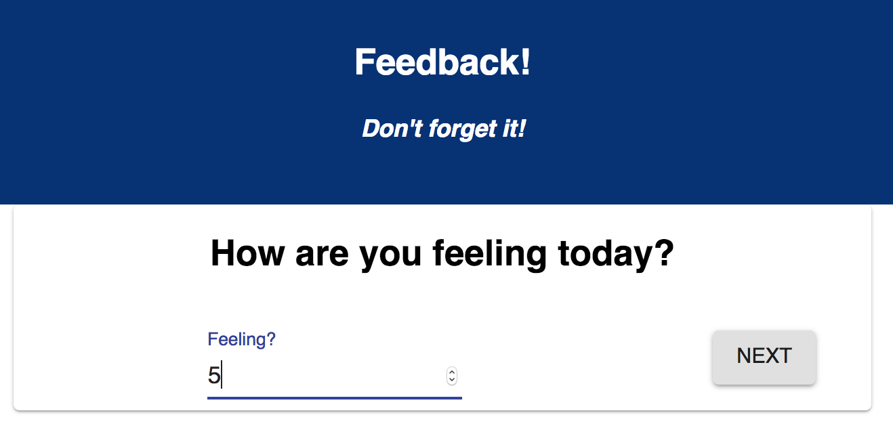

## // Redux Feedback Loop

[Project Instructions](./INSTRUCTIONS.md), this line may be removed once you have updated the README.md

## Description

Your project description goes here. What problem did you solve? How did you solve it?

Additional README details can be found [here](https://github.com/PrimeAcademy/readme-template/blob/master/README.md).

## - set up

// npm install
// npm run server

cmd + t
// npm run client

## - 4 views

- How are you feeling today?
  

- How well are you understanding the content?
  

- How well are you being supported?
  

- Any comments you want to leave?
  

## - review page

- current feedback values w/ submit button

## - languages

// Redux
